# Training a DQN agent in the Lunar lander Environment

Author: Daniel Williams

Github repository: https://github.com/dan-willia/CSPB3202-FinalProject.git

# Introduction

This project implements and evaluates Deep Q-Network (DQN) algorithms for the Lunar Lander environment from OpenAI Gymnasium. The primary objective was to train an agent that can successfully land a lunar module in a variable environment that includes a designated landing area. The requires the agent to learn precise control of vertical descent, horizontal positioning, and orientation stabilization.

The Lunar Lander environment has a continuous state space with either discrete or continuous actions. Because of its closer relation to methods we have learned in class in the Pacman labs, I chose to implement the discrete action version of the environment. However the continuous state space still represents a substantial leap beyond what we practiced in other labs, where tabular methods were adequate. Having a continuous state space means tabular methods are infeasible, since there are an uncountably infinite number of possible states. Thus, function approximation with a neural network is necessary, and DQN is a natural way to solve this. I experimented with hyperparameters, reward shaping techniques, and network architectures, to investigate what factors contribute to successful learning in this challenging control task.

The investigation progressed through five main phases:
1. **Establish baselines** with random agent and default DQN parameters, which produced agents that learned conservative hovering behavior but failed to land
1. **Hyperparameter tuning**, exploring exploration schedules, training duration, and learning rates
1. **Reward shaping**, modifying the reward structure with custom wrappers
1. **Architecture optimization** informed by literature review, implementing network configurations proven effective for this domain
1. **Ablation testing** to discover why I was unable to find the correct hyperparameters in step 2

The project ultimately achieved a mean reward of **236.39 ± 47.41** using a [256, 128] network architecture with proper exploration decay, demonstrating that both network capacity and exploration strategy are critical factors for this task.

## Approach

### Environment Description

The Lunar Lander-v3 environment simulates a spacecraft attempting to land on a flat surface between two flags. The environment provides:

**State Space (8-dimensional continuous):**
- Horizontal position (x)
- Vertical position (y)  
- Horizontal velocity (x_vel)
- Vertical velocity (y_vel)
- Angle
- Angular velocity
- Left leg ground contact (boolean)
- Right leg ground contact (boolean)

**Action Space (4 discrete actions):**
- 0: Do nothing
- 1: Fire left orientation engine
- 2: Fire main engine
- 3: Fire right orientation engine

# Phase 1: Baselines
 
I first establish some baselines. The first was a random agent, the others were agents trained on the default hyperparameters of the `DQN` model from the `stable_baselines3` library. Their default parameters are based on research, so it seemed like a reasonable place to start. I trained for 100k, 200k, and 300k timesteps on the default `DQN` parameters. 

## Baseline Results

| Baseline | Mean rewards |
| --- | --- |
| Random | -163.62 +/- 100.60 |
| Default (100k) | -60.10 +/- 78.47 |
| Default (200k) | -92.08 +/- 28.69 |
| Default (300k) | -57.36 +/- 45.85 |

Here's the random agent:

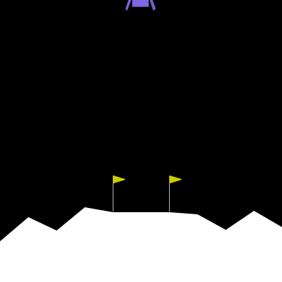

It crashes immediately as it is just randomly firing the engines.

The default baselines are more interesting. We can see that in each case, the agent has learned to hover.

Default 100k:

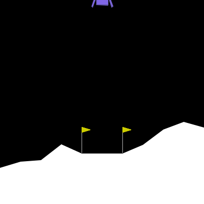

Default 200k:

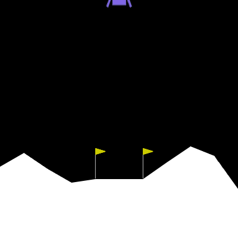

Default 300k:

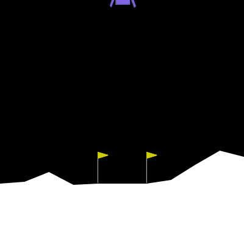

With the benefit I hindsight, I can see that simply increasing the timesteps would have led to improvements. As I was writing this report, I trained default agents with 400k and 500k timesteps and achieved significant improvements:

| Baseline | Mean rewards |
| --- | --- |
| Default (400k) | -11.29 +/- 80.06 |
| Default (500k) | -8.66 +/- 81.32 |

And if observe the agent, we can see that it indeed learns to land.

Default 400k:

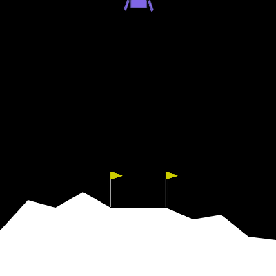

Default 500K:

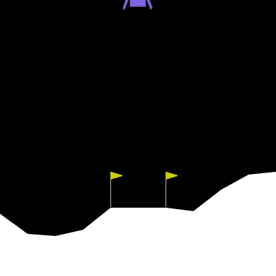

The reason I did not recognize this pattern is that I wasn't consistently observing the agent. I was looking mainly at the mean rewards. So I saw almost no improvement from 100k to 300k (a difference of only 3 points). If I had observed the agent, I would have noticed the difference in its behavior: it was getting closer to the landing pad.

This led me to assume that all the agents were simply hovering. I did not think that increasing the timesteps would lead to dramatic behavior improvements. Consequently, I pursued other experiments.

# Phase 2: Hyperparameter Tuning

## Experiment 1: Exploration fraction

I hypothesized that the reason the agent was only hovering and not landing was that agent never explored landing during the ε-greedy exploration phase, so it never discovered the high rewards associated with successful landing. I experimented with modifying the fraction of the time it spent exploring, using a timestep of 300k.

### Results

| Exploration Fraction | Mean Reward | Std Dev | Notes |
|---------------------|-------------|---------|-------|
| 0.10 (default) | -60.10 | 78.47 | Hovers, doesn't land |
| 0.15 | -43.93 | 132.01 | Still hovers |
| 0.20 | -74.65 | 110.30 | Still hovers |
| 0.30 | -86.12 | 72.71 | Still hovers |
| 0.50 | -138.72 | 25.26 | Worse performance |
| 0.75 | -135.94 | 23.99 | Worse performance |
| 0.99 | -94.99 | 26.44 | Still hovering |

### Discussion

Simply increasing exploration time did not solve the hovering problem. In fact, mean reward was _worse_ for nearly every trial of increased exploration. I observed that all agents were essentially behaving the same -- hovering until the end of the episode.

I suspected that something was wrong with these results, so I decided to set the exploration fraction at a "reasonable" number of 0.5, and I tried varying the final epsilon value.

## Experiment 2: Varying final epsilon

The epsilon starting value, final value, and fraction together determine the amount that the agent explores over the course of its training. A fraction of 0.5 means that the epsilon will decay from the starting value to the final value over the course of half of its training period. After the final epsilon value is reached, it remains at that constant value throughout the rest of the training period. 

### Results

| timesteps | exploration frac | final eps | Mean reward |
| --- | --- | --- | --- |
| 100_000 | 0.5 | 0.25 | -130.23 +/- 27.90 |
| 200_000 | 0.5 | 0.25 | -118.23 +/- 24.01 |
| 300_000 | 0.5 | 0.25 | 17.11 +/- 86.06 |
| 300_000 | 0.4 | 0.25 | -127.58 +/- 55.68 |
| **300_000** | **0.5** | **0.25** | **99.35 +/- 110.41** |
| 300_000 | 0.5 | 0.35 | not good |
| 300_000 | 0.5 | 0.15 | not good |
| 400_000 | 0.5 | 0.25 | -53.47 +/- 82.31 |
| 400_000 | 0.4 | 0.25 | -105.00 +/- 107.47 |

Trial 5 in this experiment had an unusually good result, achieiving a mean reward of 99.35. However, the high standard deviation should have indicated that this was not a reliable result. Indeed, training more agents with these parameters has never resulted in a mean reward nearly this high. Nevertheless, I took this configuration to be the best performing, and tuned further hyperparameters based on this configuration.

## Experiment 3: Learning rate

With the best configuration identified (300k timesteps, 0.5 exploration fraction, 0.25 final epsilon), I varied the learning rate:

| Learning Rate | Mean Reward | Std Dev |
|--------------|-------------|---------|
| **0.0001 (default)** | **29.45** | **106.78** |
| 0.001 | 11.88 | 76.20 |
| 0.01 | -5.03 | 155.88 |
| 0.00001 | -209.70 | 127.50 |

The default learning rate of 0.0001 performed best. Higher rates led to instability, while lower rates learned too slowly.

# Phase 3: Reward shaping

All my agents were still exhibiting the fundamental behavior problem I'd observed since the beginning: hovering. So I decided to try adding wrappers to adjust the reward structure to "force" the agent to land.

I experimented with three such wrappers which are included in the Code Examples.

In the first series of reward-shaping experiments, I made a `LandingIncentiveWrapper`, which modified the reward structure to make landing more attractive. I tried doubling and tripling the default reward while also combining this with various timesteps.

I felt I was "getting close" to the right behavior here, as the lander was immediately going towards the landing pad, but just hovering above it:

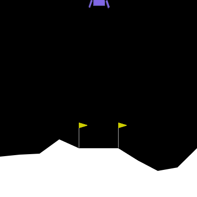

I next created an `EngineIncentiveWrapper` which penalized the use of the engines. My thinking here was to force the agent to stop using its engines; I thought this would "pull it down" towards the landing pad.

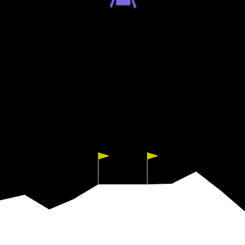

Again, we see that the agent gets very close to the landing pad, but never actually lands. Very frustrating! 

Finally, I tried combining the two wrappers, increasing the reward for landing and increasing the penalty for using the engines. I tried many combinations here, which are shown below.

### Results

| airborne penalty | leg contact bonus | main engine penalty | side engine penalty | Mean rewards | Notes |
| --- | --- | --- | --- | --- | --- |
| 0.1 | 2.0 | 3.0 | 3.0 | 6.14 +/- 106.51 |
| 0.0 | 3.0 | 1.0 | 1.0 | -92.09 +/- 77.88 |
| 0.0 | 4.0 | 1.0 | 1.0 | not good |
| 0.1 | 3.0 | 3.0 | 3.0 | -59.61 +/- 58.07 |
| 0.1 | 2.0 | 3.0 | 3.0 | -90.62 +/- 78.95 |
| 0.1 | 4.0 | 3.0 | 3.0 | -28.87 +/- 51.88 | Lands but never stops firing engine |
| 0.1 | 4.0 | 4.0 | 4.0 | -21.01 +/- 79.62 |
| 0.1 | 4.0 | 5.0 | 5.0 | -51.71 +/- 96.14 |
| 0.1 | 4.0 | 6.0 | 6.0 | -288.80 +/- 295.17 | Really bizarre strategy learned where it flies off the screen.
| 0.1 | 4.0 | 4.0 | 4.0 | -50.13 +/- 25.30 | 1m time steps
| 0.1 | 5.0 | 4.0 | 4.0 | -11.66 +/- 18.84 | 1m time steps
| 0.5 | 5.0 | 4.0 | 4.0 | very bad | 1m time steps; agent flies out of screen: time penalty too large
| 0.2 | 5.0 | 4.0 | 4.0 | -33.17 +/- 117.72 | 1m time steps; agent flies out of screen: time penalty too large
| 0.3 | 5.0 | 4.0 | 4.0 | -151.98 +/- 72.81 | 
| 0.2 | 6.0 | 4.0 | 4.0 | -111.15 +/- 96.06 | 

Here is one of the "bizarre" learned strategies, where the agent hovers just above the landing pad for some time, then lands, then relaunches itself out of the screen.

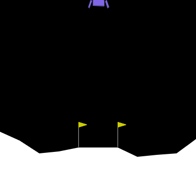

# Phase 4: Literature Review and Architecture Changes

I was at my wit's end here. I was getting agents that were refusing to land, or else landing and then taking off again. I felt I had been reasonably systematic in how I had explored the hyperparameter space, but was not making any progress. I decided to consult the research literature. 

I found a paper "Deep Q-Learning on Lunar Lander Game" which explored the same environment. The author's key findings were:

1. **Network Architecture:** Two hidden layers of [256, 128] neurons performed significantly better than smaller networks
2. **Epsilon Decay:** epsilon should decay to 0.0 (complete exploitation) rather than maintaining residual exploration
3. **Learning Rate:** Narrow optimal range of 0.0005 to 0.00005
4. **Replay Buffer:** 65,536 samples (2^16)
5. **Discount Factor:** gamma = 0.99 critical for valuing delayed rewards (landing bonus)
6. **Training Duration:** 400,000 timesteps (~2000 episodes) recommended

**Experiment 6: Paper-Informed Configuration**

Implemented the paper's recommended hyperparameters and achieved a mean reward of **236.39 ± 47.41** over 100 evaluation episodes. This was straightforward to implement except for the epsilon decay. In the `stable_baselines3` `DQN` model, the epsilon decay is linear (as discussed earlier) while in the paper it is exponential. The author used a decay of 0.99, which is very slow. To try to match this slow decay, I chose a high epsilon fraction (0.75), so that the decay is spread out over a longer time period.

With these parameters in hand, I trained an agent which was a substantial improvement over all my previous attempts. 

Here is the agent in action:

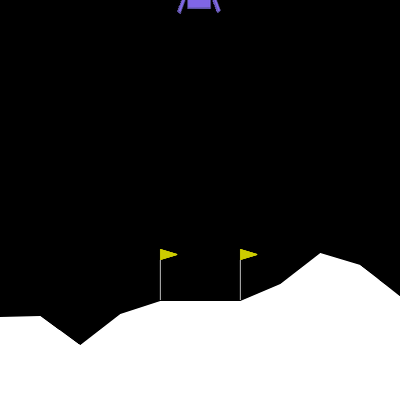

### Discussion

There were four major differences between my agents and the agent in the paper.
- **Network architecture**: I was using two hidden layers of [64, 64] neurons. This was a default parameter in the `DQN` model which I overlooked.
- **Epsilon decay**: I had found an epsilon fraction of 0.5 with a final value of 0.2 to be optimal. Still, since the epsilon decay was very slow in the research paper, and my agent's final epsilon value was quite high, this difference may not be as large as it first appears.
- **Replay buffer**: I did not experiment with this hyperparameter. But the default buffer size is much larger than what was used in the research paper (1 million vs. ~65k). This may have resulted in "stale" experiences being resampled.
- **Training duration**: the author found 400k timesteps was required. I experimented with different timesteps but generally used 300k as established in my baseline.

I wanted to try and work backwards to discover what parameters were most important in this agent, so I did a series of ablation experiments where I removed parts of the optimal agent and measured its performance.

# Phase 5: Ablation Experiments

## Ablation experiment 1

I was most curious about the network size. Was I simply doomed from the beginning by not using a big enough network? I tested the optimal hyperparameters with a network size of [64,64].

### Result
**Mean reward: 130.67 +/- 105.04**

### Discussion
In fact a smaller network performs reasonably well. The agent does learn to land, but is more cautious and has much higher variance. 

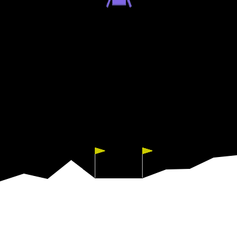

# Further ablation experiments (all with smaller network size)

Training with the larger network of [256,128] took significantly longer than the [64,64] network (~ 2 hours vs 30 minutes). Since the smaller network still achieved landing ability, I ran the rest of the ablation experiments with this smaller network size. 

| Changes from optimal | Mean rewards | GIF | Comments |
| --- | --- | --- | --- |
| eps_frac = 0.5, eps_start = 0.5, eps_final = 0.25 | -9.63 ± 76.03 | 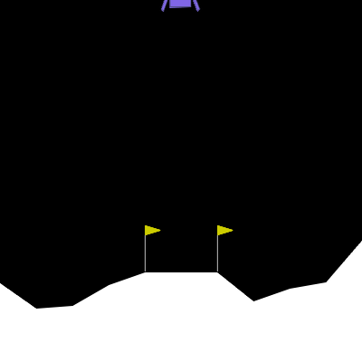 | This was my best epsilon schedule finding. Agent still hovers.
| eps_frac = 0.5, eps_start = 1.0, eps_final = 0.0 | -39.86 +/- 61.71 | 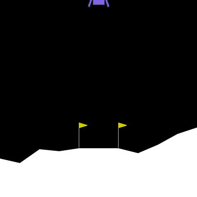 | Agent hovers; not enough time exploring?
| Replay buffer size = 1 million (default) | 27.27 +/- 79.29 | 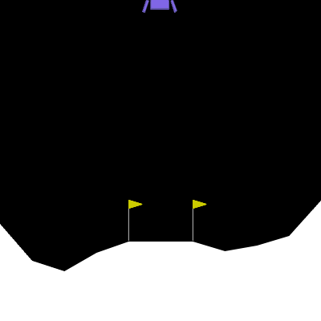 | Agent only hovers |

### Discussion

The epsilon scheduling had the largest effect on the drop in the reward. This actually contradicts the finding of the paper, which states that the lunar lander "is less sensitive to the [exploration-exploitation] trade-off than expected _if trained by sufficiently many episodes_" (p. 5 emphasis added). The persistence of the hovering behavior then may be explained by a combination of exploration and training episode count. If the agent has sufficient training episodes or exploration, then they will discover the landing state which receives a high reward, and can learn to prioritize this state. But if either exploration or training episodes are too little, then the agent doesn't experience this state, and just hovers. 

Further ablation studies could explore the impact of network size and training steps count on these results. If we increase the network size and/or training steps, can this overcome the drop in performance due to other untuned hyperparameters?

# Summary of findings

| Agent | Mean rewards | Notes | 
| --- | --- | --- |
| Random | -163.62 +/- 100.60 | Randomly firing engines |
| Default (300k timesteps) | -57.36 +/- 45.85 | Agent learns to hover | 
| Phase 2 best (hyperparameter tuning) | 99.35 +/- 110.41 | Highly variable performance: sometimes crashes, sometimes hovers |
| Phase 3 best (reward shaping) | 6.14 +/- 106.51 | Highly variable performance: will sometimes hover then eject itself from the environment | 
| Research-based hyperparameters | 236.39 +/- 47.41 | Quickly and smoothly lands |
| Research-based hyperparameters with smaller network size | 130.67 +/- 105.04 | Lands but more cautiously, high variance |

# Conclusion

This was a challenging project as there are many hyperparameters to consider, and it was not clear to me which ones to start experimenting with. In hindsight, I can see that simply increasing the timesteps was giving improvement, and I should have followed continued doing so in my baseline tests. I could also have been more systematic in how I explored the epsilon scheduling. I didn't understand very well exactly the effect it was having on the agent, and this led me to be somewhat haphazard in my conclusions from the experiments. 

Another important takeaway was to get the right network architecture early, before tuning other hyperparameters. In fact, this is the first series of experiments done in the research paper. I believe that I could have achieved a much higher baseline if I had simply increased timesteps and network size from the beginning.

Relatedly, reward shaping, while tempting, was a red herring. It did not yield any improvements and in fact led to very strange behaviors in the lander. Since these are basic environments, the reward structures are well enough established and don't need to be tuned. Probably this strategy should be a last resort.

I also learned that it is important to view the behavior of the agent during training, which can give information that is not contained in metrics like mean reward. If I had paid attention to this, I would have seen that simply increasing the training steps could have yielded more progress as the agent, although apparently only hovering, was actually descending very slowly towards the landing pad. Overall, I feel I have a much better understanding of the RL process for DQN and feel more confident in training agents of this kind in the future.

# Works Cited

Yu, X. (2019)."Deep Q-Learning on Lunar Lander Game" (2019). ResearchGate. Available: https://www.researchgate.net/publication/333145451_Deep_Q-Learning_on_Lunar_Lander_Game